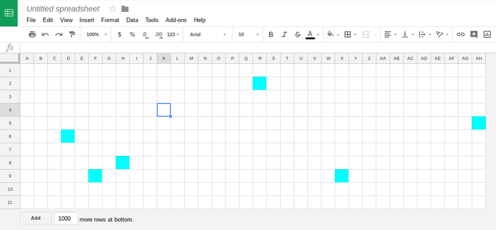

# Google-Sheets-Enemies

A enemy system proof-of-concept in Google Sheets.

To test, copy `game.gs` and open a new spreadsheet. Open `tools` and then `script editor`. Paste the code from before into the text area and find the dropdown at the top that says `select function`. Open this dropdown and select `start`. Run the script with the run button and go back to your Google Sheet. There should be some enemies moving about.
